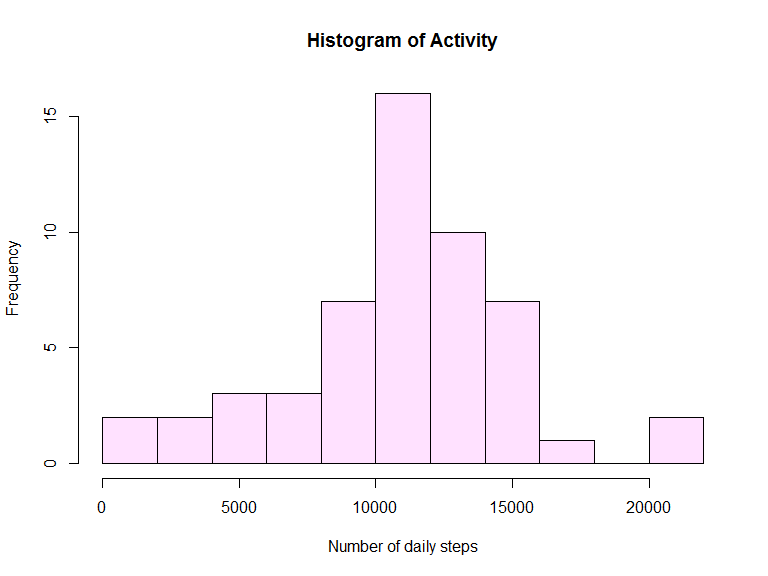
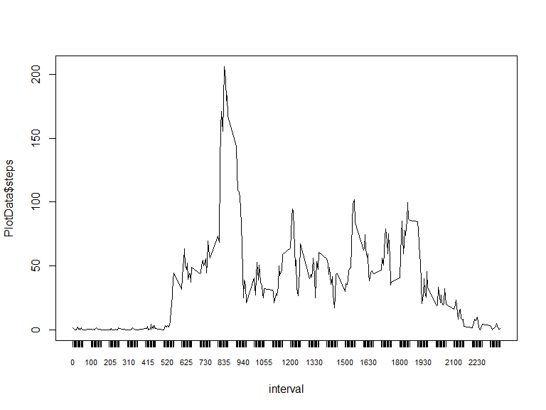
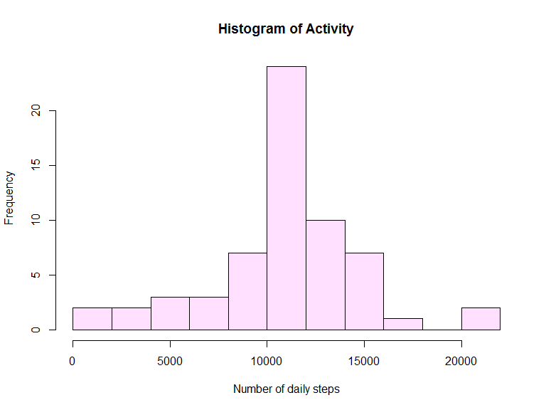
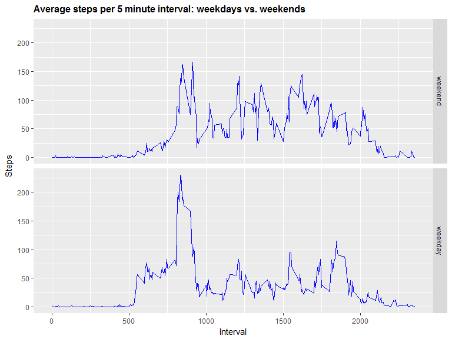

# PA1_template
KMS  
May 27, 2017  


# Working with Activity Data
Kenney Snell

## Introduction

#1. Code for reading in the dataset and/or processing the data

```r
#  setwd("C:\\Users\\app1kms\\Documents\\Training\\2017\\DataScience_Downloads\\Reproducibe_Research\\repdata%2Fdata%2Factivity")
act_df  <- read.csv("C:\\Users\\app1kms\\Documents\\Training\\2017\\DataScience_Downloads\\Reproducibe_Research\\repdata%2Fdata%2Factivity\\activity.csv")
str(act_df)
```

```
## 'data.frame':	17568 obs. of  3 variables:
##  $ steps   : int  NA NA NA NA NA NA NA NA NA NA ...
##  $ date    : Factor w/ 61 levels "2012-10-01","2012-10-02",..: 1 1 1 1 1 1 1 1 1 1 ...
##  $ interval: int  0 5 10 15 20 25 30 35 40 45 ...
```

```r
summary(act_df)
```

```
##      steps                date          interval     
##  Min.   :  0.00   2012-10-01:  288   Min.   :   0.0  
##  1st Qu.:  0.00   2012-10-02:  288   1st Qu.: 588.8  
##  Median :  0.00   2012-10-03:  288   Median :1177.5  
##  Mean   : 37.38   2012-10-04:  288   Mean   :1177.5  
##  3rd Qu.: 12.00   2012-10-05:  288   3rd Qu.:1766.2  
##  Max.   :806.00   2012-10-06:  288   Max.   :2355.0  
##  NA's   :2304     (Other)   :15840
```

Process and transform the data

```r
activity_cpl <- act_df[complete.cases(act_df),]
str(activity_cpl)
```

```
## 'data.frame':	15264 obs. of  3 variables:
##  $ steps   : int  0 0 0 0 0 0 0 0 0 0 ...
##  $ date    : Factor w/ 61 levels "2012-10-01","2012-10-02",..: 2 2 2 2 2 2 2 2 2 2 ...
##  $ interval: int  0 5 10 15 20 25 30 35 40 45 ...
```

```r
summary(activity_cpl)
```

```
##      steps                date          interval     
##  Min.   :  0.00   2012-10-02:  288   Min.   :   0.0  
##  1st Qu.:  0.00   2012-10-03:  288   1st Qu.: 588.8  
##  Median :  0.00   2012-10-04:  288   Median :1177.5  
##  Mean   : 37.38   2012-10-05:  288   Mean   :1177.5  
##  3rd Qu.: 12.00   2012-10-06:  288   3rd Qu.:1766.2  
##  Max.   :806.00   2012-10-07:  288   Max.   :2355.0  
##                   (Other)   :13536
```
#2. Make a histogram of the total number of steps taken each day
Calculate the total number of steps taken per day


```r
histData <-  aggregate(steps ~ date, data = activity_cpl, sum)
steps <- histData
```

The total number of steps taken for each day is:


```r
steps
```

```
##          date steps
## 1  2012-10-02   126
## 2  2012-10-03 11352
## 3  2012-10-04 12116
## 4  2012-10-05 13294
## 5  2012-10-06 15420
## 6  2012-10-07 11015
## 7  2012-10-09 12811
## 8  2012-10-10  9900
## 9  2012-10-11 10304
## 10 2012-10-12 17382
## 11 2012-10-13 12426
## 12 2012-10-14 15098
## 13 2012-10-15 10139
## 14 2012-10-16 15084
## 15 2012-10-17 13452
## 16 2012-10-18 10056
## 17 2012-10-19 11829
## 18 2012-10-20 10395
## 19 2012-10-21  8821
## 20 2012-10-22 13460
## 21 2012-10-23  8918
## 22 2012-10-24  8355
## 23 2012-10-25  2492
## 24 2012-10-26  6778
## 25 2012-10-27 10119
## 26 2012-10-28 11458
## 27 2012-10-29  5018
## 28 2012-10-30  9819
## 29 2012-10-31 15414
## 30 2012-11-02 10600
## 31 2012-11-03 10571
## 32 2012-11-05 10439
## 33 2012-11-06  8334
## 34 2012-11-07 12883
## 35 2012-11-08  3219
## 36 2012-11-11 12608
## 37 2012-11-12 10765
## 38 2012-11-13  7336
## 39 2012-11-15    41
## 40 2012-11-16  5441
## 41 2012-11-17 14339
## 42 2012-11-18 15110
## 43 2012-11-19  8841
## 44 2012-11-20  4472
## 45 2012-11-21 12787
## 46 2012-11-22 20427
## 47 2012-11-23 21194
## 48 2012-11-24 14478
## 49 2012-11-25 11834
## 50 2012-11-26 11162
## 51 2012-11-27 13646
## 52 2012-11-28 10183
## 53 2012-11-29  7047
```


```r
h <- hist(histData$steps,  # Save histogram as object
          breaks = 11,  # "Suggests" 11 bins for the histogram
          freq = T,
          col = "thistle1", 
          main = "Histogram of Activity",
          xlab = "Number of daily steps")
```

<!-- -->

#3. Calculate and report the mean and median of the total number of steps taken per day


```r
Mean_steps <- mean(histData$steps)
Median_steps <- median(histData$steps)
```


The mean  of the toal number of steps per day is 1.0766189\times 10^{4}.
The median of the toal number of steps per day is  10765.


#4. Time series plot of the average number of steps taken

Make a time series plot (i.e. type = "l") of the 5-minute interval (x-axis) and the average number of steps taken, averaged across all days (y-axis)


```r
histData <-  aggregate(steps ~ date, data = activity_cpl, sum)
Median_steps <- median(histData$steps)


PlotData <-  aggregate(steps ~ interval, data = activity_cpl, mean)


plot(PlotData$steps ~ interval, PlotData, xaxt = "n", type = "l")
axis(1, PlotData$interval,  cex.axis = .7)
```

<!-- -->


#5. The 5-minute interval that, on average, contains the maximum number of steps

```r
maxSteps = max(PlotData$steps)
library(dplyr)
```

```
## 
## Attaching package: 'dplyr'
```

```
## The following objects are masked from 'package:stats':
## 
##     filter, lag
```

```
## The following objects are masked from 'package:base':
## 
##     intersect, setdiff, setequal, union
```

```r
Maxinterval <- subset(PlotData, steps==maxSteps,select=interval)

Maxinterval
```

```
##     interval
## 104      835
```
The max interval is 835, for a value of 206.1698113.

#6.Code to describe and show a strategy for imputing missing data


```r
for (Var in names(act_df)) {
    missing <- sum(is.na(act_df[,Var]))
    if (missing > 0) {
       missing_steps <-  print(c(Var,missing))
    }
}
```

```
## [1] "steps" "2304"
```

The total number of missing rows is steps, 2304.
# 7. Histogram of the total number of steps taken each day after missing values are imputed

Assign the mean of that interval for missing values


```r
MeanData <-  aggregate(steps ~ interval, data = activity_cpl, mean)

# new Data Frame
act_df2 <- act_df

for (i in as.numeric(1: nrow(act_df))) {
    
    if(is.na(act_df[i,1]))  {
   
   
    MeanStep <- subset(MeanData, interval==act_df$interval[i],select=steps)
    
    act_df2[i,1] <- MeanStep

      }
     
    
    }
```


Use the new updated data frame


```r
histDataNew <-  aggregate(steps ~ date, data = act_df2, sum)
stepsNew <- histDataNew
h <- hist(histDataNew$steps,  # Save histogram as object
          breaks = 11,  # "Suggests" 11 bins for the histogram
          freq = T,
          col = "thistle1", 
          main = "Histogram of Activity",
          xlab = "Number of daily steps")
```

<!-- -->

Calculate the NEW mean and median

```r
Mean_stepsNew <- mean(histDataNew$steps)
Median_stepsNew <- median(histDataNew$steps)
```


The NEW mean  of the toal number of steps per day is 1.0766189\times 10^{4}.
The NEW median of the toal number of steps per day is  1.0766189\times 10^{4}.


The ORIGINAL mean  of the toal number of steps per day is 1.0766189\times 10^{4}.
The ORIGINAL median of the toal number of steps per day is  10765.

Result are that the mean didn't vhange becuase of using the overal mean of each interval.
But the median was slightly less.


# 8. Panel plot comparing the average number of steps taken per 5-minute interval across weekdays and weekends

a. Create a new factor variable in the dataset with two levels - "weekday" and "weekend" indicating whether a given date is a weekday or weekend day.


```r
act_df2$weekday <- weekdays(as.Date(act_df2$date))
act_df2$date <- as.Date(act_df2$date)
weekdays1 <- c('Monday', 'Tuesday', 'Wednesday', 'Thursday', 'Friday')

#Use `%in%` and `weekdays` to create a logical vector
#convert to `factor` and specify the `levels/labels`

act_df2$wday <- factor((weekdays(act_df2$date) %in% weekdays1), 
         levels=c(FALSE, TRUE), labels=c('weekend', 'weekday')
)
head(act_df2)
```

```
##       steps       date interval weekday    wday
## 1 1.7169811 2012-10-01        0  Monday weekday
## 2 0.3396226 2012-10-01        5  Monday weekday
## 3 0.1320755 2012-10-01       10  Monday weekday
## 4 0.1509434 2012-10-01       15  Monday weekday
## 5 0.0754717 2012-10-01       20  Monday weekday
## 6 2.0943396 2012-10-01       25  Monday weekday
```


New plot for Weekday and weekend


```r
 # create table with steps per time across weekdaydays or weekend days
 StepsPerTimeDT <- aggregate(steps~interval+wday,data=act_df2,FUN=mean,na.action=na.omit)
 # variable time (more comprensible for the graph axis)
 
 # draw the line plot
library(ggplot2)
 j <- ggplot(StepsPerTimeDT, aes(interval, steps))
 j+geom_line(col="blue")+ggtitle("Average steps per 5 minute interval: weekdays vs. weekends")+xlab("Interval")+ylab("Steps")+theme(plot.title = element_text(face="bold", size=12))+facet_grid(wday ~ .)
```

<!-- -->

###############


## R Markdown

This is an R Markdown document. Markdown is a simple formatting syntax for authoring HTML, PDF, and MS Word documents. For more details on using R Markdown see <http://rmarkdown.rstudio.com>.

When you click the **Knit** button a document will be generated that includes both content as well as the output of any embedded R code chunks within the document. You can embed an R code chunk like this:

